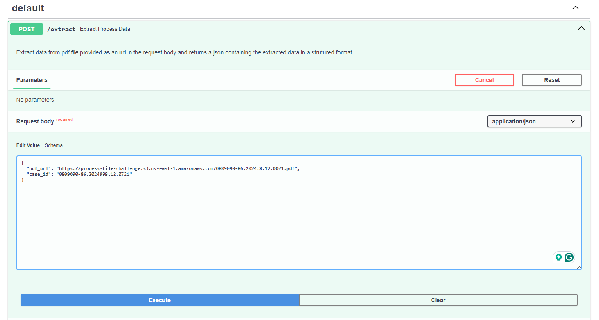
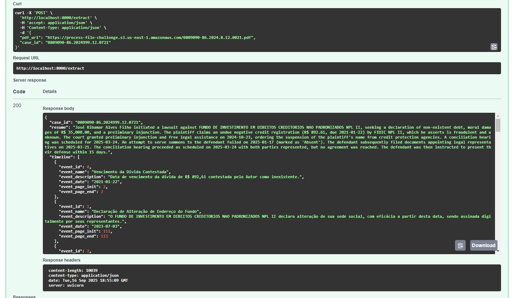
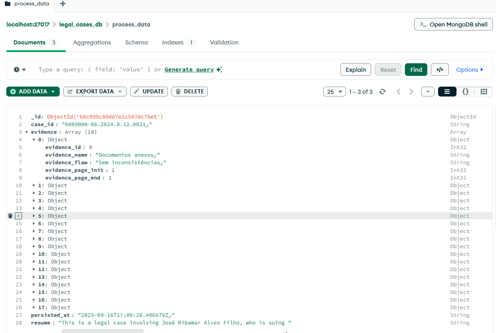
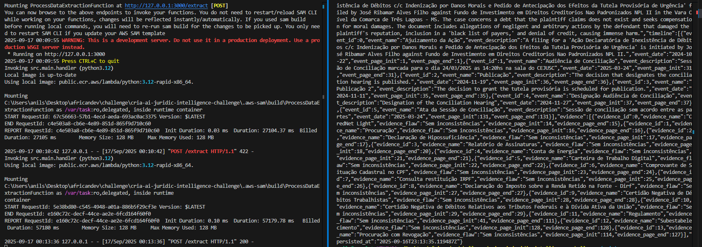
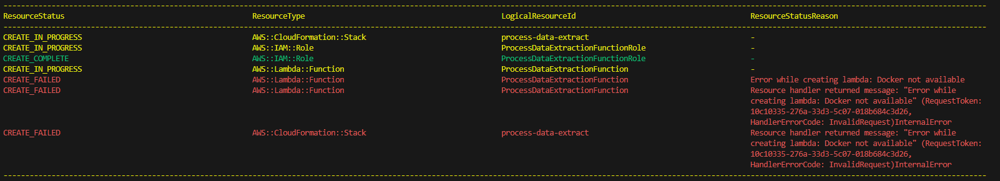

# Legal Document Analysis and Data Extraction with Gemini API

This project is a serverless application that provides an API to analyze legal documents from a PDF URL. It uses Google's Gemini API service to extract structured data (a case summary, a chronological timeline, and a list of evidence) and stores the results in a MongoDB database.

## Architecture

The application follows a simple, event-driven serverless architecture:

1.  A client sends a `POST` request with a JSON payload containing a `pdf_url` and the `case_id` to the API endpoint `/extract`.
2.  API Gateway triggers an **AWS Lambda** function.
3.  The Lambda function:
    a. Downloads the PDF file from the provided URL.
    b. Uploads the file to the **Google Gemini API** for analysis.
    c. Receives the structured JSON data back from Gemini.
    d. Saves the extracted data to a **MongoDB** database.
4.  The Lambda function returns the extracted JSON data to the client.

```
  Client
    │
    │ POST /extract
    ▼
┌──────────────────┐
│ API Gateway      │
└──────────────────┘
    │
    │ Triggers
    ▼
┌──────────────────┐
│   AWS Lambda     │───►┌───────────────────┐
│ (process_data)   │    │ Google Gemini API │
└──────────────────┘    └───────────────────┘
    │
    │ Saves data
    ▼
┌──────────────────┐
│     MongoDB      │
└──────────────────┘
```

### Project struture

The project is strutured using the ports/adapters pattern, where we have the follwing layers:
- `domain`: Contains the core business logic and entities. This layer is independent of external frameworks or databases.
- `application`: Orchestrates the domain objects to perform specific tasks. It defines interfaces for interacting with external services (ports).
- `infrastructure`: Implements the interfaces defined in the application layer (adapters). This layer deals with external concerns like databases, APIs, and frameworks.

For example the storage layer could be changed in the implementation part to use a DynamoDB database instead of a MongoDB database, by adding to the infrastruture/adapters an implementation for the DynomoDB storage interface.


## Prerequisites

Before begin, ensure the following installed and configured:

*   **AWS CLI**: Configure AWS credentials.
*   **AWS SAM CLI**: For building, testing, and deploying the application.
*   **Docker**: Required for building Lambda dependencies and running local services.
*   **Python 3.12**: The runtime for the Lambda function.
*   **Google Gemini API Key**: Get one from Google AI Studio.

## Project Setup

1.  **Clone the Repository**
    ```bash
    git clone <repository-url>
    cd cria-ai-juridic-intelligence-challenge
    ```

2.  **Create a Virtual Environment**
    ```bash
    python3 -m venv venv
    source venv/bin/activate
    # On Windows, use: venv\Scripts\activate
    ```

3.  **Install Dependencies**
    The project's Python dependencies are listed in `requirements.txt` file. The `pip install -r requirements.txt` command will install them.

4.  **Configure Environment Variables for Local Testing**

    Create a file named `.env` in the project root. This file will provide environment variables for local testing. An example of the variables is provided in `.env.example`

    ```
    GEMINI_API_KEY="api-key"
    GEMINI_MODEL_NAME="gemini-2.0-flash"
    MONGODB_DB_NAME="process_data_db"
    MONGODB_URI="mongodb://localhost:27017/"
    ```

    - Replace `API_KEY` with actual gemini API key from https://aistudio.google.com/.


## Local Development and Testing

1.  **Start Local MongoDB**
    The docker compose contains service for the mongo database and localstack configuration (the free version of localstack doenst provide storage services).
    ```bash
    docker compose up -d
    ```

2.  **Run the API Locally**
    Running the following command at the root of the project starts the api server and hot-reloads on code changes.
    ```bash
    python -m src.main
    ```
    A swagger documentation that comes with the fastapi implementation will be available at `http://127.0.0.1:8000/docs`.




3.  **Invoke the Function Locally**
    Send a request to the local endpoint using `curl` or an API client like Postman.
    ```bash
    curl -X POST http://127.0.0.1:8000/extract \
    -H "Content-Type: application/json" \
    -d '{"pdf_url": "URL_TO_LEGAL_DOCUMENT.pdf", "case_id": "CASE_ID"}'
    ```

Example response:



```json
{
  "case_id": "0809090-86.2024999.12.0721",
  "resume": "José Ribamar Alves Filho initiated a lawsuit against FUNDO DE INVESTIMENTO EM DIREITOS CREDITORIOS NAO PADRONIZADOS NPL II, seeking a declaration of non-existent debt, moral damages of R$ 35,000.00, and a preliminary injunction. The plaintiff claims an undue negative credit registration (R$ 892.61, due 2021-01-22) by FIDIC NPL II, which he asserts is fraudulent and unknown. The court granted preliminary injunction and free legal assistance on 2024-10-23, ordering the suspension of the plaintiff's name from credit protection agencies. A conciliation hearing was scheduled for 2025-03-24. An attempt to serve summons to the defendant failed on 2025-01-17 (marked as 'Absent'). The defendant subsequently filed documents appointing legal representatives on 2025-03-21. The conciliation hearing proceeded as scheduled on 2025-03-24 with both parties represented, but no agreement was reached. The defendant was then instructed to present their defense within 15 days.",
  "timeline": [
    {
      "event_id": 0,
      "event_name": "Vencimento da Dívida Contestada",
      "event_description": "Data de vencimento da dívida de R$ 892,61 contestada pelo Autor como inexistente.",
      "event_date": "2021-01-22",
      "event_page_init": 2,
      "event_page_end": 2
    },
    ...
  ],
  "evidence": [
    {
      "evidence_id": 0,
      "evidence_name": "Relatório de Consulta Crednet Light",
      "evidence_flaw": "Contém registro de dívida (\"Pendência Pefin\") de R$ 892,61 em nome do Autor, com vencimento em 22/01/2021, que é contestada como inexistente/fraudulenta.",
      "evidence_page_init": 14,
      "evidence_page_end": 15
    },
   ...
  ],
  "persisted_at": "2025-09-16T18:57:47.718540Z"
}
```


Using MongoCompass for instance we can validate the persistence of the extracted data:


## Deployment to AWS Localstack

1.  **Build the Application**
    The `--use-container` flag builds the function inside a Docker container that mimics the Lambda environment.
    ```bash
    samlocal build --use-container
    ```

    To improve build times we can use cache ater the first build:
    
    ```bash
    samlocal build --use-container --cached
    ```

2.  **Guided Deployment**
    The first deploy, can use the `--guided` flag. SAM will prompt for deployment parameters.

    ```bash
    samlocal deploy --guided
    ```

    It will ask for:
    - **Stack Name**: A unique name for CloudFormation stack (e.g., `legal-doc-analyzer`).
    - **AWS Region**: The region to deploy to (e.g., `us-east-1`).
    - **Parameter `GeminiApiKey`**: **Enter Google Gemini API key**.
    - **Parameter `MongoDbUri`**: The connection string for the MongoDB (e.g., a MongoDB Atlas URI).
    - **Confirm changes before deploy**: Answer `y`.
    - **Allow SAM CLI IAM role creation**: Answer `y`.

    SAM will save the choices in `samconfig.toml` for future deployments.

3. **Start the Service**

  To invoke the lambda we can start the local enviroment by running:
  ```bash
  sam local start-api
  ```

  It will run the docker image of the app and provide a url for local testing like in the following logs:
  ```
  Mounting ProcessDataExtractionFunction at http://127.0.0.1:3000/extract [POST]
  You can now browse to the above endpoints to invoke your functions. You do not need to restart/reload SAM CLI while      
  working on your functions, changes will be reflected instantly/automatically. If you used sam build before running local 
  commands, you will need to re-run sam build for the changes to be picked up. You only need to restart SAM CLI if you     
  update your AWS SAM template
  2025-09-16 21:36:45 WARNING: This is a development server. Do not use it in a production deployment. Use a production WSGI server instead.
  * Running on http://127.0.0.1:3000
  2025-09-16 21:36:45 Press CTRL+C to quit
  ```

  Then we can call the service by running a curl command like this:
  ```bash
  curl -X POST \
    'http://127.0.0.1:3000/extract' \
    -H 'accept: application/json' \
    -H 'Content-Type: application/json' \
    -d '{"pdf_url":"https://process-file-challenge.s3.us-east-1.amazonaws.com/0809090-86.2024.8.12.0021.pdf","case_id":"0809090-86.2024.8.12.0021"}'
  ```

  Following we have a local test of the api using `sam local start-api` command:

  

## Cleanup

To delete the deployed application and all associated AWS resources, run:
```bash
samlocal delete
```

## Future works

- Implement unit and integration tests
- Fix and improve configuration for lambda deployment (eg. use environment variables in localstack, create deployment scripts)
- Optimise build process (eg. use cache, sam configurations with env variables)
- Add more validations for data input and response from gemini
- Test best model for file analysis
- Explorre the possibility of getting metrics and XAI features from the model output to evaluate possible alucinations or inacurate data output


## Issues

- During the trials the following error was occuring while deploying locally using the `samlocal deploy --guided` command:



- Some local tests presented the following error:
```
google.genai.errors.ServerError: 503 UNAVAILABLE. {'error': {'code': 503, 'message': 'The model is overloaded. Please try again later.', 'status': 'UNAVAILABLE'}}
```
Changing and choosing another available model may solve the issue temporarily, in the .env configuratin file
```
GEMINI_MODEL_NAME="gemini-2.5-flash"
```

- the provided pdf_url currently only accepts public urls, 403 error codes may be returned if no open access to the pdf is available